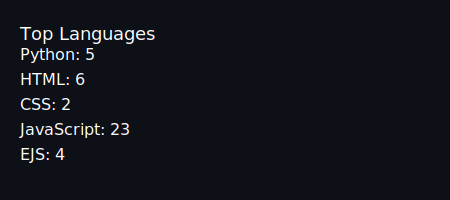

# 💫 About Me:
👨‍💻 Full-stack developer with a strong interest in cybersecurity and scalable system design   🏢 Currently working as a Software Engineer at Hacktify, building security and cloud-based platforms   ⚙️ Experienced with Node.js, Docker, cloud infrastructure, and backend architecture   🛡️ Currently building cyber-range and security training platforms   🤖 Interested in automation, distributed systems, and DevSecOps   🧩 Enjoy solving complex engineering problems and building systems from scratch

## 🌐 Socials:
   

# 💻 Tech Stack:
                                                                                         

---

## 📊 GitHub Statistics

<!--GITHUB_STATS_START-->

- ⭐ Public Repositories: 46
- 👥 Followers: 2
- 👤 Following: 0
- 📅 Last Updated: 3/8/2026, 5:57:48 PM

<!--GITHUB_STATS_END-->

<table>
<tr>
<td width="50%">
  
</td>

<td width="50%">
  
</td>
</tr>
</table>

 

## 🔝 Top Contributed Repositories

<!--TOP_REPOS_START-->
- ⭐ 0 - [12_ProductReviewAnalysis](https://github.com/chinmay0910/12_ProductReviewAnalysis)
- ⭐ 0 - [AirportAviation](https://github.com/chinmay0910/AirportAviation)
- ⭐ 0 - [Alarm-Clock](https://github.com/chinmay0910/Alarm-Clock)
- ⭐ 0 - [Anouncement-System](https://github.com/chinmay0910/Anouncement-System)
- ⭐ 0 - [AviationChallenge](https://github.com/chinmay0910/AviationChallenge)
<!--TOP_REPOS_END-->

# 📦 Latest Repositories

<!--LATEST_REPOS_START-->
- **chinmay0910** ⭐ 0 | 🍴 0
- **passport-photo-maker** ⭐ 0 | 🍴 0
- **PhishingMails_Admin** ⭐ 0 | 🍴 1
- **ViolenceDetection** ⭐ 0 | 🍴 0
- **Event-Management-System** ⭐ 0 | 🍴 1
<!--LATEST_REPOS_END-->

---
